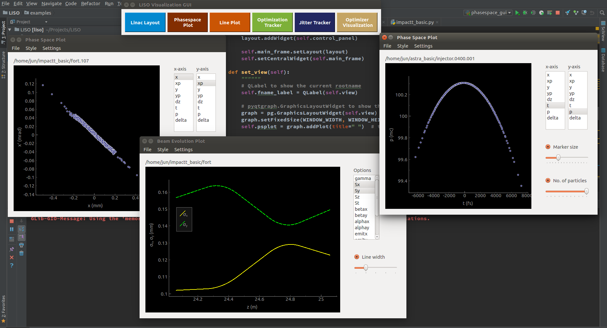

# LISO

Jun Zhu

---

## Introduction

**Li**nac **S**imulation and **O**ptimization.

An API for various beam dynamics and FEL codes like ASTRA, IMPACT-T, IMPACT-Z and GENESIS.

## Dependencies

Python3 >= 3.5

#### Beam dynamis and FEL codes:
- [ASTRA](http://www.desy.de/~mpyflo/)
- [IMPACT-T](http://portal.nersc.gov/project/m669/IMPACT-T/)
- [IMPACT-Z]
- [GENESIS]

#### External optimizers:
- [pyOpt](http://www.pyopt.org/) > 1.2.0 (optional)

#### Visualization GUI:
- [pyqtgraph](http://www.pyqtgraph.org/)

## Installation

- Download and install LinacOpt
```sh
$ git clone https://github.com/zhujun98/LISO.git
$ cd liso
$ python setup.py install
```

- Download and install pyOpt
```sh
$ git clone https://github.com/zhujun98/pyOpt
$ cd pyOpt
$ python setup.py install
```
**It is recommended to uninstall the old version before installing a new one**. To uninstall:

```sh
$ python setup.py install --record files.txt
$ cat files.txt | xargs rm -rf
```

## GUI

```py
from liso import gui

gui()
```




## Optimization

LISO has its own single- and multi-objective optimizers. It also provides interfaces for external optimizers like [pyOpt](http://www.pyopt.org/).

### Own optimizers

##### ALPSO
##### MOPSO

### pyOpt optimizers 

##### [Augmented Lagrangian Particle Swarm Optimizer](http://www.pyopt.org/reference/optimizers.alpso.html#module-pyALPSO)

##### [Non Sorting Genetic Algorithm II](http://www.pyopt.org/reference/optimizers.nsga2.html#module-pyNSGA2)

##### [SDPEN](http://www.pyopt.org/reference/optimizers.sdpen.html#module-pySDPEN)


